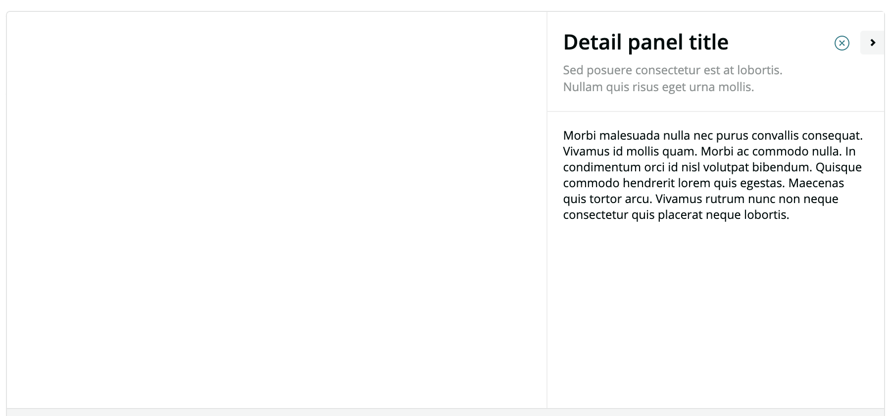
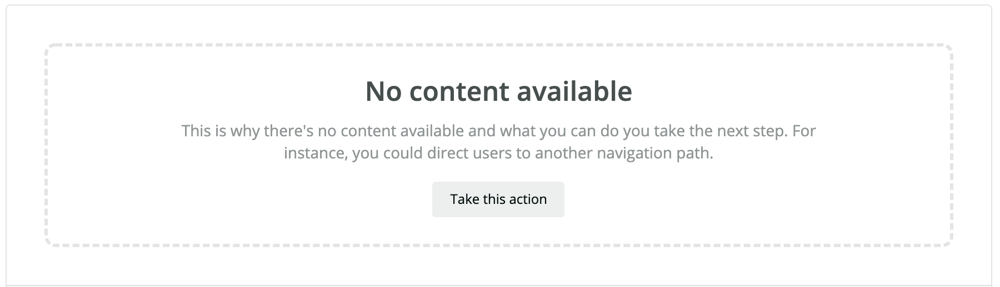
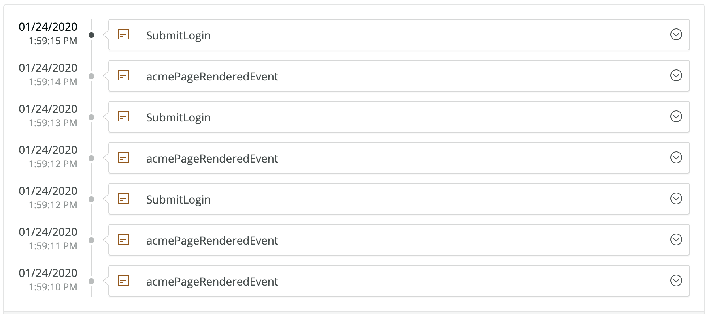
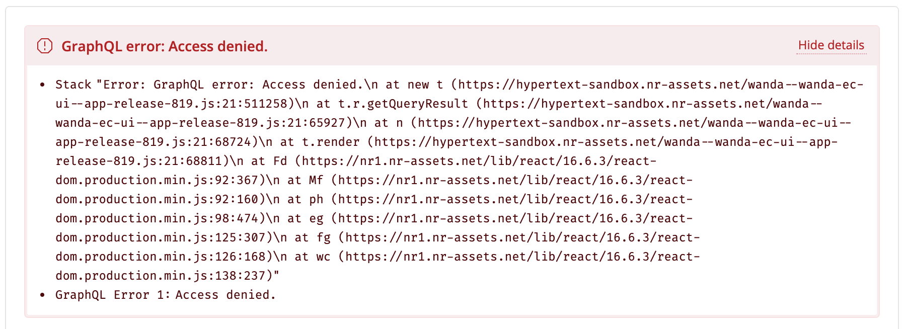
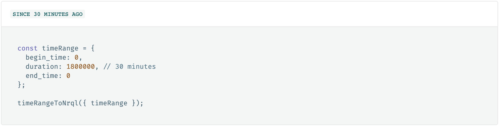

[](https://github.com/newrelic/open-source-office/blob/master/examples/categories/index.md#community-project)

# nr1-community

 [](https://snyk.io/test/github/newrelic/nr1-community)

A community-driven library of useful components for building on New Relic One's programmability platform.

This library is built on top of and requires the 'nr1' core library available to Nerdpacks as part of running inside of the New Relic One platform, documentation on this underlying library can be found on [our developer site](https://developer.newrelic.com/client-side-sdk/index.html)

<!-- START doctoc generated TOC please keep comment here to allow auto update -->
<!-- DON'T EDIT THIS SECTION, INSTEAD RE-RUN doctoc TO UPDATE -->
**Table of Contents**  *generated with [DocToc](https://github.com/thlorenz/doctoc)*

- [Links](#links)
- [Usage](#usage)
- [Components](#components)
  - [DetailPanel](#detailpanel)
  - [EmptyState](#emptystate)
  - [Timeline](#timeline)
  - [Funnel (coming soon)](#funnel-coming-soon)
  - [NerdGraphError](#nerdgrapherror)
- [Utilities](#utilities)
  - [timeRangeToNrql](#timerangetonrql)
  - [bytesToSize (coming soon)](#bytestosize-coming-soon)
- [Local Development](#local-development)
- [How do I add my component?](#how-do-i-add-my-component)
  - [Add to component library](#add-to-component-library)
  - [Add to demo/examples](#add-to-demoexamples)
- [Related work](#related-work)
  - [New Relic One SDK](#new-relic-one-sdk)
  - [NewRelic Developer Site](#newrelic-developer-site)
  - [Boilerplate Nerdpack Layouts](#boilerplate-nerdpack-layouts)
- [Open Source License](#open-source-license)
- [Support](#support)
  - [Community](#community)
  - [Issues / Enhancement Requests](#issues--enhancement-requests)
- [Contributing](#contributing)

<!-- END doctoc generated TOC please keep comment here to allow auto update -->

## Links

- 📘[New Relic One's core components](https://developer.newrelic.com/client-side-sdk/index.html)
- 🔨[Change Log](docs/CHANGELOG.md)
- 📓[Demo](demo/README.md)

## Usage

Install in your project:

```bash
npm install --save @newrelic/nr1-community
```

Import the component/utils into your nerdlet:

```js
import { DetailPanel, EmptyState, Timeline, NerdGraphError, timeRangeToNrql } from '@newrelic/nr1-community';
```

Import styles into your styles.scss (or similar):

```sass
@import '~@newrelic/nr1-community/dist/index.css'
```

## Components

For complete documentation and a demo, please visit [Demo](demo/README.md) and follow the instructions for viewing.

### [DetailPanel](src/components/DetailPanel/README.md)



### [EmptyState](src/components/EmptyState/README.md)



### [Timeline](src/components/Timeline/README.md)



### [Funnel (coming soon)](src/components/Funnel/README.md)


### [NerdGraphError](src/components/NerdGraphError/README.md)



## Utilities

### [timeRangeToNrql](src/utils/timeRangeToNrql/README.md)


### [bytesToSize (coming soon)](src/utils/bytesToSize/README.md)

## Local Development

The `/demo` folder of this project is a Nerdpack that references the local copy of the components. You are able to develop the components and see how they function in a live environment as you develop them!

1. Open two terminals, navigate both to the root of this repository
2. In one, start up the demo site with the following commands ([Full Demo Info](demo/README.md))

```sh
  cd demo
  npm install
  nr1 nerdpack:uuid -gf # Only needed the first time
  npm start
```

3. In the other, navigate to the root of this repository and run:

```sh
  npm install
  npm start
```

> Note: You're running `npm install` twice, once for nr1-community and once for the /demo Nerdpack.

Our bundler will watch for changes in /src and auto-build the library. The Demo Nerdpack will see these changes and perform its own live-reloading, referencing the local copy of the library.

## How do I add my component?

### Add to component library

1. Fork this repository
1. Create a new folder under `src/components` or `src/utils` with the name of your component (subject to review)
    1. Create a `index.js` so that the full path looks like `src/components/<name of component>/index.js`
    1. Create a `README.md` that will serve as the primary documentation for your component
    1. Create a `meta.json` and define the props your component requires/accepts
1. Export your component by adding an export line: `export { <name of component> } from './<name of component>';` to `src/components/index.js` or `src/utils/index.js`

### Add to demo/examples

Our goal here is to aggregate helpful information from your component, like the `README.md` and the `meta.json` (as some structured documentation of the component) alongside live code examples. We aim to keep each component's page as similar as possible and have a pattern we'd like you to follow, the easiest approach is to reference an existing one, but if you have troubles, open a pull-request as-is and we're happy to assist.

1. Create a new "page" (folder) in our demo Nerdpack under `<location-of-repo>/demo/nerdlets/nr1-community-demo-nerdlet/pages`. See existing components for a pattern to follow.
1. Your component's folder should contain the following:
    1. An `index.js`
    1. An `/examples` directory
1. Export your component's page in `<location-of-repo>/demo/nerdlets/nr1-community-demo-nerdlet/pages/index.js` like: `export { default as FooComponent } from './FooComponent';`
1. Add your component to the "page list" in `<location-of-repo>/demo/nerdlets/nr1-community-demo-nerdlet/index.js`

> Note: You'll notice us referencing the local components with the `@`, this isn't new JS magic. We've extended the typical Nerdpack's webpack config with an alias `@` for the "src" folder of the library to make imports a little less painful.

## Related work

### New Relic One SDK

[https://developer.newrelic.com/client-side-sdk/index.html](https://developer.newrelic.com/client-side-sdk/index.html)

### NewRelic Developer Site

[https://developer.newrelic.com](https://developer.newrelic.com)

### Boilerplate Nerdpack Layouts

- [Standard](https://github.com/newrelic/nr1-nerdpack-layout-standard)
- [Double Sidebar](https://github.com/newrelic/nr1-nerdpack-layout-double-sidebar)
- [4x2 Grid](https://github.com/newrelic/nr1-nerdpack-layout-4x2-grid)
- [4 Column](https://github.com/newrelic/nr1-nerdpack-layout-4-column)
- [3 Column](https://github.com/newrelic/nr1-nerdpack-layout-3-column)
- [T-bone](https://github.com/newrelic/nr1-nerdpack-layout-t-bone)
- [2x2 Grid](https://github.com/newrelic/nr1-nerdpack-layout-2x2-grid)
- [3x2 Grid](https://github.com/newrelic/nr1-nerdpack-layout-3x2-grid)

All of these and more can be found on our public Github - [Layout template Nerdpacks](https://github.com/newrelic?utf8=%E2%9C%93&q=nr1-nerdpack-layout&type=&language=)

## Open Source License

This project is distributed under the [Apache 2 license](LICENSE).

## Support

New Relic has open-sourced this project. This project is provided AS-IS WITHOUT WARRANTY OR DEDICATED SUPPORT. Issues and contributions should be reported to the project here on GitHub.

We encourage you to bring your experiences and questions to the [Explorers Hub](https://discuss.newrelic.com) where our community members collaborate on solutions and new ideas.

### Community

New Relic hosts and moderates an online forum where customers can interact with New Relic employees as well as other customers to get help and share best practices. Like all official New Relic open source projects, there's a related Community topic in the New Relic Explorers Hub. 

### Issues / Enhancement Requests

Issues and enhancement requests can be submitted in the [Issues tab of this repository](../../issues). Please search for and review the existing open issues before submitting a new issue.

## Contributing

Contributions are welcome (and if you submit a Enhancement Request, expect to be invited to contribute it yourself :grin:). Please review our [Contribution Guide](CONTRIBUTING.md).

Keep in mind that when you submit your pull request, you'll need to sign the CLA via the click-through using CLA-Assistant. If you'd like to execute our corporate CLA, or if you have any questions, please drop us an email at opensource+nr1-community@newrelic.com.
